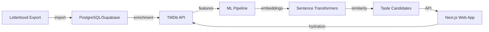

# 🎬 Apollo - Cinéma Personnalisé par IA

> **Découvre des films "pépites" que les algorithmes mainstream ignorent.**

Apollo est un système de recommandation cinématographique qui utilise des **embeddings sémantiques** pour comprendre tes goûts au-delà des simples notes. Il privilégie les films de niche et les découvertes authentiques plutôt que les blockbusters grand public.

---

## 🌟 Caractéristiques

- **🧠 IA Sémantique** : Analyse le sens profond des films (synopsis, thèmes, ambiance) plutôt que de se fier aux tags génériques
- **💎 Détection de Niche** : Identifie automatiquement les films sous-estimés avec un potentiel de découverte élevé
- **🇫🇷 Interface Française** : UX en français, données ML en anglais pour une meilleure qualité sémantique
- **📊 Transparence** : Score de compatibilité explicable (similarité cosinus avec ton profil)
- **⚡ Performance** : Optimisations DB-first, batch processing, requêtes TMDb contrôlées

---

## 🏗️ Architecture



**Stack Technique** :
- **Web** : Next.js 16 (App Router), TypeScript, Tailwind CSS, Supabase SSR
- **ML** : Python 3.10+, sentence-transformers, NumPy, PostgreSQL (psycopg2)
- **Données** : Supabase (PostgreSQL), TMDb API, HuggingFace Models

---

## 🚀 Installation & Démarrage

### Prérequis

- **Node.js** 20+ et npm
- **Python** 3.10+ avec pip
- **Clés API** :
  - [TMDb API Key](https://www.themoviedb.org/settings/api) (gratuit)
  - [Supabase Project](https://supabase.com) (tier gratuit disponible)

### 🌐 Web App

```bash
cd apps/web

# Installation
npm install

# Configuration
cp .env.example .env.local
# Remplis NEXT_PUBLIC_SUPABASE_URL, NEXT_PUBLIC_SUPABASE_PUBLISHABLE_DEFAULT_KEY,
# TMDB_API_KEY, TMDB_API_READ_ACCESS_TOKEN dans .env.local

# Lancement (dev)
npm run dev
# Ouvre http://localhost:3000

# Production
npm run build
npm start
```

**Variables d'environnement** :
- `NEXT_PUBLIC_SUPABASE_URL` : URL de ton projet Supabase (ex: `https://xxx.supabase.co`)
- `NEXT_PUBLIC_SUPABASE_PUBLISHABLE_DEFAULT_KEY` : Clé Supabase publique (anon key)
- `TMDB_API_KEY` : Clé API TMDb v3
- `TMDB_API_READ_ACCESS_TOKEN` : Token Bearer TMDb v4 (optionnel mais recommandé)

### 🤖 ML Pipeline

```bash
cd apps/ml

# Environnement virtuel
python -m venv .venv
source .venv/bin/activate  # Windows: .venv\Scripts\activate

# Dépendances
pip install -r requirements.txt

# Configuration
cp .env.example .env.local
# Remplis TMDB_API_KEY et TMDB_API_READ_ACCESS_TOKEN

# Configuration de la base de données
# Édite utils/database.py avec tes credentials Supabase

# Pipeline complet (première utilisation)
# 1. Place ton fichier letterboxd-data.csv dans data/
python pipelines/01_import_letterboxd.py

# 2. Enrichissement TMDb
python pipelines/02_sync_tmdb_features.py

# 3. Génération des embeddings
python pipelines/03_build_embeddings.py

# 4. Calcul des recommandations
python pipelines/04_build_taste_candidates_full.py

# 🔁 Renouvellement rapide (après de nouvelles interactions)
python pipelines/04_build_taste_candidates_full.py
# Ce script est "intelligent" : il skip les films déjà traités
```

**Schéma de base de données** : Voir [`doc/guidelines/data-contracts.md`](doc/guidelines/data-contracts.md)

---

## 📖 Documentation

### Guides Essentiels

- **[🧠 ML pour Débutants](doc/ml/00-getting-started.md)** : Guide zéro-connaissance pour comprendre le système ML
- **[📚 Concepts ML](doc/ml/01-what-is-ml.md)** : Embeddings, similarité cosinus, recherche sémantique expliqués simplement
- **[🔄 Vue d'ensemble des Pipelines](doc/ml/02-pipeline-overview.md)** : Diagramme du flux de données ML
- **[🌐 Architecture Web](doc/web/architecture.md)** : Next.js SSR, Supabase, optimisations

### Documentation Complète

```
doc/
├── guidelines/              # Contrats et philosophie
│   ├── project-philosophy.md
│   ├── data-contracts.md
│   ├── interface-contracts.md
│   └── api-requirements.md
├── ml/                      # Documentation ML détaillée
│   ├── 00-getting-started.md
│   ├── 01-what-is-ml.md
│   ├── 02-pipeline-overview.md
│   ├── pipelines/
│   │   ├── 01-import-letterboxd.md
│   │   ├── 02-sync-tmdb-features.md
│   │   ├── 03-build-embeddings.md
│   │   └── 04-build-candidates.md
│   ├── embeddings.md
│   ├── features.md
│   └── troubleshooting.md
└── web/                     # Documentation web
    ├── architecture.md
    ├── components/
    ├── services/
    └── routes.md
```

---

## 🎯 Philosophie du Projet

**Apollo privilégie** :
1. **Découverte authentique** sur popularité mainstream
2. **Pertinence sémantique** sur correspondance de tags
3. **Transparence algorithmique** sur boîte noire
4. **Performance DB** sur appels API excessifs

Voir [`doc/guidelines/project-philosophy.md`](doc/guidelines/project-philosophy.md) pour plus de détails.

---

## 🛠️ Structure du Projet

```
Apollo/
├── apps/
│   ├── web/                 # Application Next.js
│   │   ├── src/
│   │   │   ├── app/         # Routes (App Router)
│   │   │   ├── components/  # Composants React
│   │   │   ├── services/    # Logique métier
│   │   │   ├── lib/         # TMDb client, utils
│   │   │   └── types/       # Types TypeScript
│   │   └── package.json
│   └── ml/                  # Pipeline ML Python
│       ├── pipelines/       # Scripts de traitement
│       ├── clients/         # TMDb & DB wrappers
│       ├── embeddings/      # Modèle & similarité
│       ├── features/        # Feature engineering
│       ├── utils/           # Helpers
│       └── requirements.txt
└── doc/                     # Documentation miroir
```

---

## 🔧 Configuration Avancée

### ML Pipeline (`apps/ml/config/settings.py`)

- `MIN_RATING_FOR_SIMILAR` : Seuil de note pour expansion de candidats (défaut: 8)
- `MAX_TASTE_CANDIDATES` : Nombre de recommandations à stocker (défaut: 2000)
- `TMDB_RATE_LIMIT_DELAY` : Délai entre requêtes TMDb (défaut: 1.5s pour 40/min)
- `EMBEDDING_MODEL` : Modèle HuggingFace (défaut: `paraphrase-multilingual-MiniLM-L12-v2`)

### Web App

- **Pagination** : 50 films par page (`/recommandations`)
- **Batch TMDb** : 10 requêtes parallèles max pour hydratation
- **Filtrage** : DB-first (genres depuis `movie_features`), hydratation post-filtre

---

## 🐛 Dépannage

### Erreur TMDb "429 Too Many Requests"
→ Augmente `TMDB_RATE_LIMIT_DELAY` dans `apps/ml/config/settings.py`

### Modèle sentence-transformers ne se télécharge pas
→ Assure-toi d'avoir une connexion internet stable. Le modèle (~120MB) est téléchargé automatiquement au premier lancement.

### Base de données vide
→ Vérifie tes credentials Supabase dans `apps/ml/utils/database.py` et assure-toi que les tables existent (voir schéma dans `/doc/guidelines/data-contracts.md`)

Voir [`doc/ml/troubleshooting.md`](doc/ml/troubleshooting.md) pour plus de solutions.

---

## 📊 Exemples de Résultats

Après avoir executé le pipeline ML :
- **Top 10 recommandations** : Affichées dans le terminal
- **2000 candidats** : Stockés dans `taste_candidates` table
- **Interface web** : Consultation à `/recommandations` avec filtrage par mood/genre

---

## 📝 License

Projet personnel - Pas de license formelle pour le moment.

---

## 🙏 Crédits

- **TMDb** : Métadonnées et API
- **HuggingFace** : Modèles sentence-transformers
- **Supabase** : Backend et base de données
- **Letterboxd** : Format d'export standardisé
