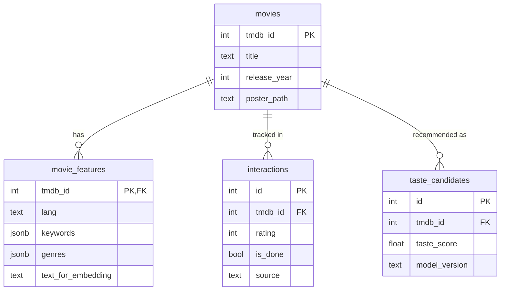

# Contrats de Données Apollo

Ce document définit les schémas de toutes les tables de base de données et leurs interfaces TypeScript correspondantes.

---

## 📊 Schéma PostgreSQL (Supabase)

### Table `movies`

Stocke les métadonnées de base des films provenant de TMDb.

```sql
CREATE TABLE movies (
    tmdb_id INTEGER PRIMARY KEY,
    title TEXT NOT NULL,
    release_year INTEGER,
    poster_path TEXT,
    updated_at TIMESTAMPTZ DEFAULT NOW()
);

CREATE INDEX idx_movies_title ON movies(title);
```

**Colonnes** :
- `tmdb_id` : Identifiant unique TMDb (clé primaire)
- `title` : Titre du film (peut être english ou français selon la source)
- `release_year` : Année de sortie (extrait de `release_date`)
- `poster_path` : Chemin relatif de l'affiche TMDb (ex: `/abc123.jpg`)
- `updated_at` : Horodatage de la dernière mise à jour

**Interface TypeScript** :
```typescript
export interface Movie {
    tmdb_id: number;
    title: string;
    release_year: number | null;
    poster_path: string | null;
    updated_at: string; // ISO 8601
}
```

---

### Table `movie_features`

Contient les métadonnées enrichies pour les embeddings ML (toujours en anglais).

```sql
CREATE TABLE movie_features (
    tmdb_id INTEGER PRIMARY KEY REFERENCES movies(tmdb_id),
    lang TEXT CHECK (lang IN ('en', 'fr')) NOT NULL DEFAULT 'en',
    overview TEXT,
    keywords JSONB DEFAULT '[]',
    genres JSONB DEFAULT '[]',
    "cast" JSONB DEFAULT '[]',
    crew JSONB DEFAULT '[]',
    text_for_embedding TEXT,
    tmdb_fetched_at TIMESTAMPTZ DEFAULT NOW()
);

CREATE INDEX idx_movie_features_tmdb ON movie_features(tmdb_id);
```

**Colonnes** :
- `tmdb_id` : Référence vers `movies.tmdb_id`
- `lang` : Langue des données (`'en'` pour ML, `'fr'` pour affichage)
- `overview` : Synopsis complet
- `keywords` : Tableau JSON d'objets `{id: number, name: string}`
- `genres` : Tableau JSON d'objets `{id: number, name: string}`
- `cast` : Tableau JSON d'objets TMDb cast (top 10 acteurs)
- `crew` : Tableau JSON d'objets TMDb crew (réalisateur principalement)
- `text_for_embedding` : Texte composite utilisé pour générer l'embedding
- `tmdb_fetched_at` : Date de récupération depuis TMDb

**Format JSONB** :

```json
// keywords
[{"id": 1234, "name": "time travel"}, {"id": 5678, "name": "dystopia"}]

// genres
[{"id": 878, "name": "Science Fiction"}, {"id": 18, "name": "Drama"}]

// cast (simplifié)
[
  {"id": 123, "name": "Jake Gyllenhaal", "character": "Donnie Darko", "order": 0},
  {"id": 456, "name": "Jena Malone", "character": "Gretchen Ross", "order": 1}
]

// crew (simplifié)
[{"id": 789, "name": "Richard Kelly", "job": "Director"}]
```

**Interface TypeScript** :
```typescript
export interface MovieFeatures {
    tmdb_id: number;
    lang: 'en' | 'fr';
    overview: string | null;
    keywords: Array<{ id: number; name: string }>;
    genres: Array<{ id: number; name: string }>;
    cast: Array<{ id: number; name: string; character: string; order: number }>;
    crew: Array<{ id: number; name: string; job: string }>;
    text_for_embedding: string | null;
    tmdb_fetched_at: string;
}
```

---

### Table `interactions`

Historique des interactions utilisateur (notes, wishlist, films vus).

```sql
CREATE TABLE interactions (
    id SERIAL PRIMARY KEY,
    tmdb_id INTEGER NOT NULL REFERENCES movies(tmdb_id),
    rating INTEGER CHECK (rating >= 1 AND rating <= 10),
    is_done BOOLEAN DEFAULT FALSE,
    is_wishlisted BOOLEAN DEFAULT FALSE,
    is_recommended BOOLEAN DEFAULT FALSE,
    source TEXT CHECK (source IN ('letterboxd', 'app')),
    created_at TIMESTAMPTZ DEFAULT NOW()
);

CREATE INDEX idx_interactions_tmdb ON interactions(tmdb_id);
CREATE INDEX idx_interactions_rating ON interactions(rating);
```

**Colonnes** :
- `id` : Identifiant auto-incrémenté
- `tmdb_id` : Référence vers le film
- `rating` : Note de 1 à 10 (NULL si pas encore noté)
- `is_done` : Film déjà vu
- `is_wishlisted` : À voir plus tard
- `is_recommended` : Film recommandé manuellement par l'utilisateur
- `source` : Provenance (`'letterboxd'` import ou `'app'` saisie manuelle)
- `created_at` : Date de création

**Interface TypeScript** :
```typescript
export interface Interaction {
    id: number;
    tmdb_id: number;
    rating: number | null;
    is_done: boolean;
    is_wishlisted: boolean;
    is_recommended: boolean;
    source: 'letterboxd' | 'app';
    created_at: string;
}
```

---

### Table `taste_candidates`

Recommandations personnalisées calculées par le pipeline ML.

```sql
CREATE TABLE taste_candidates (
    id SERIAL PRIMARY KEY,
    tmdb_id INTEGER NOT NULL REFERENCES movies(tmdb_id),
    taste_score FLOAT NOT NULL,
    model_version TEXT NOT NULL,
    generated_at TIMESTAMPTZ DEFAULT NOW()
);

CREATE INDEX idx_taste_candidates_score ON taste_candidates(taste_score DESC);
CREATE INDEX idx_taste_candidates_tmdb ON taste_candidates(tmdb_id);
```

**Colonnes** :
- `id` : Identifiant auto-incrémenté
- `tmdb_id` : Référence vers le film recommandé
- `taste_score` : Score de similarité cosinus (0.0 à 1.0)
- `model_version` : Version du modèle d'embedding utilisé (ex: `"paraphrase-multilingual-MiniLM-L12-v2_v2"`)
- `generated_at` : Date de génération des recommandations

**Interface TypeScript** :
```typescript
export interface TasteCandidate {
    id: number;
    tmdb_id: number;
    taste_score: number; // 0.0 - 1.0
    model_version: string;
    generated_at: string;
    // Champs joints (optionnels, ajoutés dynamiquement)
    title?: string;
    poster_path?: string | null;
    release_year?: number | null;
    overview?: string;
    genres?: string[]; // Noms de genres (ex: ["Action", "Thriller"])
    is_niche?: boolean; // Calculé côté client via TMDb
}
```

---

### Table `recommendation_history` (Future)

*Non encore implémentée - réservée pour tracking des films affichés.*

```sql
CREATE TABLE recommendation_history (
    id SERIAL PRIMARY KEY,
    tmdb_id INTEGER NOT NULL REFERENCES movies(tmdb_id),
    shown_at TIMESTAMPTZ DEFAULT NOW()
);
```

---

### Table `movie_emotion_labels`

Stocke les labels émotionnels soumis par l'utilisateur pour l'entraînement du modèle (vérité terrain).

```sql
CREATE TABLE movie_emotion_labels (
    id SERIAL PRIMARY KEY,
    tmdb_id INTEGER NOT NULL REFERENCES movies(tmdb_id),
    emotion TEXT NOT NULL CHECK (emotion IN ('joy', 'trust', 'fear', 'surprise', 'sadness', 'disgust', 'anger', 'anticipation')),
    intensity INTEGER DEFAULT 1 CHECK (intensity >= 1 AND intensity <= 5),
    created_at TIMESTAMPTZ DEFAULT NOW(),
    UNIQUE(tmdb_id, emotion)
);

CREATE INDEX idx_emotion_labels_tmdb ON movie_emotion_labels(tmdb_id);
```

**Colonnes** :
- `id` : Identifiant unique
- `tmdb_id` : Film concerné
- `emotion` : Une des 8 émotions primaires de Plutchik
- `intensity` : Force de l'émotion (1-5), par défaut 1
- `created_at` : Date de création

**Interface TypeScript** :
```typescript
export type PlutchikEmotion = 'joy' | 'trust' | 'fear' | 'surprise' | 'sadness' | 'disgust' | 'anger' | 'anticipation';

export interface MovieEmotionLabel {
    id: number;
    tmdb_id: number;
    emotion: PlutchikEmotion;
    intensity: number;
    created_at: string;
}
```

## 🔗 Relations



---

## 📝 Contraintes d'Intégrité

### Upserts

Toutes les insertions utilisent `ON CONFLICT ... DO UPDATE` pour éviter les doublons :

```sql
-- Exemple pour movies
INSERT INTO movies (tmdb_id, title, release_year, poster_path, updated_at)
VALUES (123, 'Example', 2020, '/path.jpg', NOW())
ON CONFLICT (tmdb_id) 
DO UPDATE SET 
    title = EXCLUDED.title,
    release_year = EXCLUDED.release_year,
    poster_path = EXCLUDED.poster_path,
    updated_at = NOW();
```

### Cascades

**Pas de CASCADE DELETE** sur les foreign keys pour éviter les suppressions accidentelles. Les suppressions doivent être explicites.

---

## 🔄 Migrations

Les modifications de schéma doivent être versionnées et appliquées via migrations SQL.

**Exemple de migration** :

```sql
-- migration_001_add_popularity.sql
ALTER TABLE movie_features
ADD COLUMN popularity FLOAT DEFAULT 0.0;

CREATE INDEX idx_movie_features_popularity ON movie_features(popularity);
```

**Application** :
```bash
psql -h <host> -U <user> -d <database> -f migrations/migration_001_add_popularity.sql
```

---

## 🛡️ Validation

### Backend (Python)

Les pipelines ML utilisent les helpers du `DatabaseClient` qui incluent validation implicite :

```python
# upsert_movie vérifie que tmdb_id est un int et title est non-null
db.upsert_movie(tmdb_id=12345, title="Example", release_year=2020, poster_path="/abc.jpg")
```

### Frontend (TypeScript)

Les types sont strictement appliqués via `database.ts` :

```typescript
import { TasteCandidate } from '@/types/database';

function processCandidate(candidate: TasteCandidate) {
    // TypeScript garantit que candidate.taste_score est un number
    const percentage = candidate.taste_score * 100;
}
```

---

## 📊 Exemples de Requêtes

### Récupérer les top 10 recommandations

```sql
SELECT 
    tc.taste_score,
    m.title,
    m.release_year,
    m.poster_path
FROM taste_candidates tc
JOIN movies m ON tc.tmdb_id = m.tmdb_id
ORDER BY tc.taste_score DESC
LIMIT 10;
```

### Trouver les films notés 8+ par l'utilisateur

```sql
SELECT m.*, i.rating
FROM interactions i
JOIN movies m ON i.tmdb_id = m.tmdb_id
WHERE i.rating >= 8
ORDER BY i.rating DESC, i.created_at DESC;
```

### Filtrer les candidats par genre (en mémoire, post-fetch)

```typescript
// Côté Next.js
const { data } = await supabase
    .from('taste_candidates')
    .select(`
        *,
        movies (title, poster_path, release_year),
        movies!inner(movie_features(genres))
    `)
    .order('taste_score', { ascending: false })
    .limit(1000);

// Filtrage JavaScript
const actionMovies = data.filter(c => 
    c.movies.movie_features.genres.some(g => g.name === 'Action')
);
```

---

## 🔐 Sécurité

### Row Level Security (RLS)

*À implémenter pour un système multi-utilisateurs* :

```sql
ALTER TABLE interactions ENABLE ROW LEVEL SECURITY;

CREATE POLICY user_interactions ON interactions
    FOR ALL
    USING (auth.uid() = user_id);
```

Pour l'instant, Apollo est mono-utilisateur, donc RLS n'est pas activé.

---

## 📚 Ressources

- [Supabase Schema Docs](https://supabase.com/docs/guides/database/tables)
- [PostgreSQL JSONB](https://www.postgresql.org/docs/current/datatype-json.html)
- [TypeScript Interfaces](https://www.typescriptlang.org/docs/handbook/interfaces.html)
