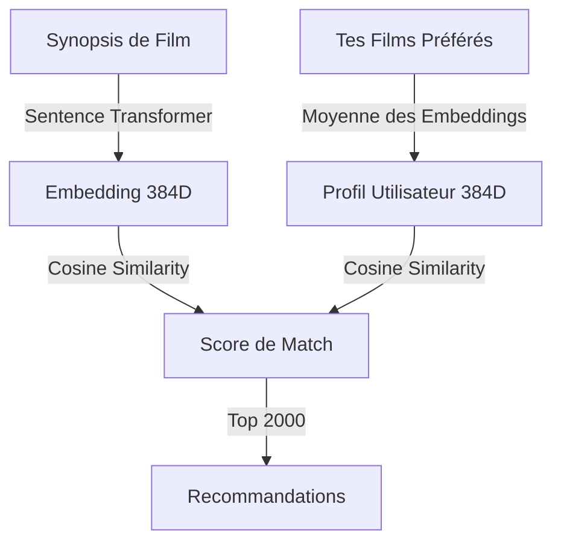

# Qu'est-ce que le Machine Learning ? (Concepts pour Apollo)

> **Pour qui ?** Développeurs sans background ML/AI qui veulent comprendre comment Apollo fonctionne sous le capot.

---

## 🤖 Machine Learning en Une Phrase

**Machine Learning (ML)** = Faire apprendre des patterns aux ordinateurs à partir de données, **sans programmer explicitement chaque règle**.

---

## 📖 Les 3 Types de ML (Simplifié)

### 1. Apprentissage Supervisé (Supervised Learning)
**Principe** : Tu montres des exemples avec les bonnes réponses, le modèle apprend à prédire.

**Exemple** :
```
Entrée: Photo de chat → Sortie: "chat" ✓
Entrée: Photo de chien → Sortie: "chien" ✓
... 10 000 exemples ...
→ Le modèle apprend à reconnaître chats vs chiens
```

**Apollo l'utilise ?** ❌ Non.

---

### 2. Apprentissage Non Supervisé (Unsupervised Learning)
**Principe** : Tu donnes des données sans réponses, le modèle trouve des patterns tout seul.

**Exemple** :
```
Films: [Inception, Interstellar, The Prestige, Mean Girls, Legally Blonde]
→ Le modèle groupe automatiquement:
  Cluster 1: [Inception, Interstellar, The Prestige] (films Nolan-esque)
  Cluster 2: [Mean Girls, Legally Blonde] (comédies adolescentes)
```

**Apollo l'utilise ?** ⚠️ Indirectement (via embeddings pré-entraînés).

---

### 3. Apprentissage par Transfert (Transfer Learning)
**Principe** : Quelqu'un a déjà entraîné un modèle sur BEAUCOUP de données. Tu l'utilises directement.

**Exemple** :
```
Google a entraîné un modèle pour comprendre les phrases (millions d'exemples)
→ Tu télécharges ce modèle
→ Tu l'utilises pour analyser tes propres textes (synopsis de films)
→ Pas besoin de refaire l'entraînement !
```

**Apollo l'utilise ?** ✅ **OUI** — C'est exactement ça !

**Modèle utilisé** : `sentence-transformers/paraphrase-multilingual-MiniLM-L12-v2`

---

## 🧠 Embeddings : Le Cœur d'Apollo

### Définition Formelle

Un **embedding** est une **représentation vectorielle dense** (liste de nombres) qui capture la **sémantique** (sens) d'un objet (texte, image, audio, etc.).

### Pourquoi On Utilise Ça ?

**Problème** : Les ordinateurs ne comprennent pas le texte brut.

**Solution 1 (Naïve)** — Bag of Words :
```
"Donnie Darko is a psychological thriller"
→ {donnie: 1, darko: 1, is: 1, a: 1, psychological: 1, thriller: 1}
```
❌ **Problème** : Pas de notion de sens. "thriller" et "suspense" sont considérés différents.

**Solution 2 (ML)** — Embeddings :
```
"Donnie Darko is a psychological thriller"
→ [0.234, -0.112, 0.456, ..., -0.321] (384 nombres)

"Memento is a mind-bending suspense film"
→ [0.221, -0.098, 0.489, ..., -0.305] (384 nombres)
```
✅ **Avantage** : Les deux vecteurs sont **proches** car le sens est similaire, même si les mots sont différents.

---

### Propriétés des Embeddings

#### 1. Dimension

**Dimension** = Nombre de composants du vecteur.

**Apollo** : 384 dimensions (choisi par le modèle `MiniLM`).

**Analogie** :
- 2D : Un point sur un plan (x, y)
- 3D : Un point dans l'espace (x, y, z)
- 384D : Un point dans un espace à 384 axes (impossible à visualiser, mais mathématiquement valide)

#### 2. Distance Sémantique

Deux textes **similaires** auront des vecteurs **proches**.

**Exemple** :
```python
import numpy as np

# Vecteurs simplifiés (en vrai: 384D)
film_a = np.array([0.8, -0.3, 0.5])  # "Dark psychological thriller"
film_b = np.array([0.75, -0.25, 0.52])  # "Suspenseful mind game"
film_c = np.array([-0.2, 0.9, -0.6])  # "Romantic comedy"

# Distance euclidienne (formule de Pythagore généralisée)
distance_a_b = np.linalg.norm(film_a - film_b)  # Petite distance → similaires
distance_a_c = np.linalg.norm(film_a - film_c)  # Grande distance → différents

print(distance_a_b)  # ~0.08 (proches)
print(distance_a_c)  # ~1.5 (éloignés)
```

#### 3. Arithmétique Vectorielle

**Propriété magique** : Tu peux "additionner" des concepts.

**Exemple célèbre (Word2Vec)** :
```
vec("King") - vec("Man") + vec("Woman") ≈ vec("Queen")
```

**Dans Apollo** (hypothétique) :
```
vec("Inception") - vec("Heist") + vec("Drama") ≈ vec("A slow-paced cerebral film")
```

On n'utilise pas cette propriété directement, mais c'est pour illustrer que les embeddings capturent des **relations sémantiques**.

---

## 📏 Similarité Cosinus : Mesurer la Proximité

### Pourquoi Pas la Distance Euclidienne ?

**Distance euclidienne** : Longueur directe entre deux points.

**Problème** : Sensible à la **magnitude** (longueur du vecteur).

**Exemple** :
```
vec_a = [1, 2, 3]  (longueur ≈ 3.74)
vec_b = [2, 4, 6]  (longueur ≈ 7.48) — c'est juste vec_a × 2

Distance euclidienne(a, b) ≈ 3.74 → Considérés "différents"
Mais ils pointent dans la MÊME direction → Devraient être similaires !
```

**Solution** : Similarité cosinus (mesure l'**angle**, pas la longueur).

---

### Formule

```
cosine_similarity(A, B) = (A · B) / (||A|| × ||B||)
```

**Composants** :
- `A · B` : Produit scalaire (dot product) = Σ(A[i] × B[i])
- `||A||` : Norme de A = sqrt(Σ(A[i]²))
- `||B||` : Norme de B = sqrt(Σ(B[i]²))

**Range de valeurs** :
- `1.0` : Vecteurs identiques (angle = 0°)
- `0.0` : Vecteurs perpendiculaires (aucune similarité)
- `-1.0` : Vecteurs opposés

---

### Exemple Concret

```python
import numpy as np

def cosine_similarity(a, b):
    return np.dot(a, b) / (np.linalg.norm(a) * np.linalg.norm(b))

# Deux films similaires
film_a = np.array([0.8, -0.3, 0.5, 0.2])
film_b = np.array([0.75, -0.25, 0.52, 0.18])

# Un film différent
film_c = np.array([-0.3, 0.9, -0.4, -0.1])

print(cosine_similarity(film_a, film_b))  # ~0.998 → Très similaires
print(cosine_similarity(film_a, film_c))  # ~-0.15 → Différents
```

**Interprétation Apollo** :
```
Ton profil: [0.65, -0.22, 0.48, ...]
Film candidat: [0.68, -0.18, 0.52, ...]
Similarité: 0.89 → 89% de match ! 🎯
```

---

## 🏗️ Sentence Transformers : Le Modèle Apollo

### Qu'est-ce Que C'est ?

**Sentence Transformers** est une bibliothèque Python qui fournit des **modèles pré-entraînés** pour générer des embeddings de phrases.

**Site officiel** : [sbert.net](https://www.sbert.net)

---

### Modèle Utilisé

**Nom** : `paraphrase-multilingual-MiniLM-L12-v2`

**Caractéristiques** :
- **Multilingue** : Supporte 50+ langues (mais meilleur en anglais)
- **MiniLM** : Version "Mini" (rapide, léger)
- **L12** : 12 layers (équilibre performance/vitesse)
- **v2** : Version améliorée

**Dimensions** : 384

**Taille** : ~120 MB

**Performance** : ~1000 phrases/sec sur CPU (MacBook Pro)

---

### Comment Ça a Été Entraîné ?

**Pas de panique**, tu n'as pas besoin de comprendre ça pour utiliser Apollo — mais par curiosité :

1. **Corpus** : Millions de paires de phrases (paraphrase dataset)
   ```
   "The cat sat on the mat" ↔ "A feline rested on the rug"
   ```
2. **Objectif** : Apprendre à donner des embeddings **similaires** aux phrases de même sens
3. **Architecture** : Transformer neural network (genre BERT)
4. **Entraînement** : Des semaines sur GPU clusters (Google, universités, etc.)

**Résultat** : Un fichier `.bin` que tu télécharges et utilises directement.

---

### Utilisation en Code

```python
from sentence_transformers import SentenceTransformer

# Charger le modèle (télécharge ~120MB la première fois)
model = SentenceTransformer('paraphrase-multilingual-MiniLM-L12-v2')

# Encoder une phrase
text = "A dark psychological thriller about time travel"
embedding = model.encode(text)

print(embedding.shape)  # (384,)
print(embedding[:5])    # [0.234, -0.112, 0.456, 0.789, -0.321]
```

**Batch Encoding** (plus rapide) :
```python
texts = [
    "Inception is a mind-bending heist",
    "Interstellar explores space and time",
    "Mean Girls is a teen comedy"
]

embeddings = model.encode(texts, batch_size=32, show_progress_bar=True)
print(embeddings.shape)  # (3, 384)
```

---

## 🔍 Recherche Sémantique vs Recherche par Mots-Clés

### Recherche par Mots-Clés (Traditionnelle)

**Requête** : "dark time travel film"

**Algorithme** :
```sql
SELECT * FROM movies
WHERE overview LIKE '%dark%'
  AND overview LIKE '%time%'
  AND overview LIKE '%travel%'
```

**Résultats** :
- ✅ "Donnie Darko" (contient "dark", "time", "travel")
- ❌ "Primer" (même thème mais mots différents : "causality", "paradox")
- ✅ "Dark Shadows" (contient "dark" mais c'est un vampire film, pas time travel ❌)

**Problème** : Match sur **mots exacts**, pas sur **sens**.

---

### Recherche Sémantique (Apollo)

**Requête** : "dark time travel film"

**Algorithme** :
```python
# 1. Convertir la requête en embedding
query_emb = model.encode("dark time travel film")

# 2. Calculer similarité avec tous les films
for film in database:
    film_emb = get_embedding(film.id)
    similarity = cosine_similarity(query_emb, film_emb)
    results.append((film, similarity))

# 3. Trier par similarité décroissante
results.sort(key=lambda x: x[1], reverse=True)
```

**Résultats** :
- ✅ "Donnie Darko" (0.92) — match parfait
- ✅ "Primer" (0.88) — sens similaire malgré vocabulaire différent
- ✅ "Looper" (0.85) — thème similaire
- ❌ "Dark Shadows" (0.23) — "dark" présent mais contexte différent

**Avantage** : Match sur **sémantique**, pas juste sur mots.

---

## 🎬 Application à Apollo

### Pipeline Simplifié



### Exemple Numérique

**Tes films 10/10** :
- Inception (emb: [0.8, -0.3, 0.5, ...])
- Interstellar (emb: [0.75, -0.25, 0.48, ...])
- The Prestige (emb: [0.78, -0.28, 0.52, ...])

**Profil utilisateur** (moyenne) :
```python
user_profile = np.mean([emb_inception, emb_interstellar, emb_prestige], axis=0)
# Résultat: [0.777, -0.277, 0.5, ...]
```

**Film candidat** : Shutter Island
```
Embedding: [0.72, -0.22, 0.48, ...]
Similarité: cosine(user_profile, emb_shutter) = 0.87
→ Match: 87% ✅
```

---

## 🧩 FAQ Techniques

### Q: Pourquoi 384 dimensions et pas 100 ou 1000 ?

**R** : C'est un **trade-off** choisi par les créateurs du modèle :
- **Moins de dimensions (ex: 100)** → Plus rapide, mais perd de la nuance sémantique
- **Plus de dimensions (ex: 1000)** → Meilleure précision, mais plus lent et risque d'overfitting

384 est un bon équilibre pour des tâches de similarité de phrases.

---

### Q: Peut-on visualiser un embedding 384D ?

**R** : Pas directement (humains = max 3D). Mais on peut utiliser **réduction de dimensionnalité** :

**Techniques** :
- **PCA** (Principal Component Analysis)
- **t-SNE**
- **UMAP**

**Exemple de visualisation** (réduction 384D → 2D) :
```python
from sklearn.manifold import TSNE
import matplotlib.pyplot as plt

# Réduire embeddings à 2D
tsne = TSNE(n_components=2)
embeddings_2d = tsne.fit_transform(embeddings_384d)

# Scatter plot
plt.scatter(embeddings_2d[:, 0], embeddings_2d[:, 1])
plt.show()
```

**Résultat** : Points proches = films similaires (visuellement).

---

### Q: Est-ce que le modèle "comprend" vraiment le sens ?

**R** : **Non**, pas comme un humain. Le modèle a appris des **patterns statistiques** :
- Quels mots apparaissent ensemble
- Quels contextes sont similaires
- Quelles phrases sont des paraphrases

**Mais** : Ces patterns capturent suffisamment de structure sémantique pour être **utiles** en pratique.

**Analogie** : Une calculatrice ne "comprend" pas les maths, mais elle donne les bonnes réponses.

---

### Q: Pourquoi ne pas fine-tuner le modèle sur des synopsis de films ?

**R** : Possibilités futures, mais pour l'instant :
- ✅ **Modèle pré-entraîné suffit** : Déjà très bon sur du texte général
- ❌ **Manque de données** : Fine-tuning nécessite des milliers d'exemples (paires de synopsis similaires)
- ❌ **Complexité** : Nécessite GPU, expertise ML, temps

**Apollo privilégie la simplicité** : Modèle pré-entraîné = zéro maintenance.

---

## 📚 Ressources pour Aller Plus Loin

### Débutant
- [Sentence-BERT Paper (2019)](https://arxiv.org/abs/1908.10084) — Article original (technique)
- [Illustrated Word2Vec](https://jalammar.github.io/illustrated-word2vec/) — Visualisation des embeddings

### Intermédiaire
- [Sentence Transformers Docs](https://www.sbert.net) — Documentation officielle
- [HuggingFace Course](https://huggingface.co/course) — Gratuit, très pédagogique

### Avancé
- [Attention Is All You Need](https://arxiv.org/abs/1706.03762) — Paper original Transformers
- [BERT Explained](https://jalammar.github.io/illustrated-bert/) — Architecture BERT

---

## 🎯 Résumé des Concepts Clés

| Concept | Définition Simple | Dans Apollo |
|---------|------------------|-------------|
| **ML** | Apprendre des patterns sans règles explicites | Utilise modèle pré-entraîné |
| **Embedding** | Vecteur numérique qui capture le sens | 384D pour chaque film |
| **Similarité Cosinus** | Mesure de proximité sémantique | Score de match 0-1 |
| **Sentence Transformer** | Modèle pour générer embeddings de phrases | MiniLM multilingue |
| **Recherche Sémantique** | Trouver des résultats par sens, pas mots | Cœur du système de reco |

---

**Prochaines lectures** :
- [Vue d'Ensemble des Pipelines](02-pipeline-overview.md)
- [Documentation Pipeline 03 (Embeddings)](pipelines/03-build-embeddings.md)
