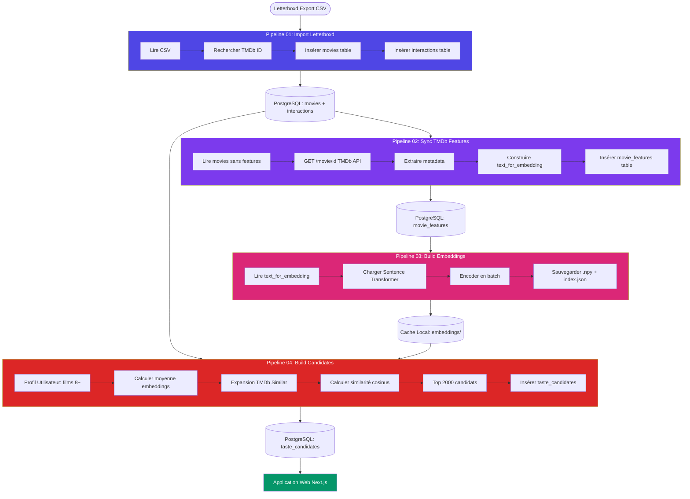

# Vue d'Ensemble des Pipelines ML

> **Objectif** : Comprendre le flux complet de données, de Letterboxd CSV → Recommandations personnalisées.

---

## 🔄 Diagramme de Flux Complet



---

## 📋 Résumé des Pipelines

| Pipeline | Input Principal | Output Principal | Temps Estimé | API Calls |
|----------|----------------|------------------|--------------|-----------|
| **01** | `letterboxd-data.csv` | `movies`, `interactions` | 2-5 min | TMDb Search |
| **02** | `movies` (tmdb_id) | `movie_features` | 5-15 min | TMDb Details |
| **03** | `movie_features.text_for_embedding` | `embeddings.npy` | 1-3 min | Aucun |
| **04** | `interactions` + embeddings | `taste_candidates` | 10-20 min | TMDb Similar |

**Temps total première exécution** : ~20-40 minutes (selon nombre de films et connexion)

---

## 🎯 Quand Exécuter Chaque Pipeline ?

### Première Installation
```bash
# Ordre strict
python pipelines/01_import_letterboxd.py
python pipelines/02_sync_tmdb_features.py
python pipelines/03_build_embeddings.py
python pipelines/04_build_taste_candidates_full.py
```

### Après Ajout de Nouvelles Notes
```bash
# Si tu as mis à jour tes notes Letterboxd
python pipelines/01_import_letterboxd.py  # Importe nouveaux films
python pipelines/04_build_taste_candidates_full.py  # Recalcule

# Pas besoin de 02 et 03 (déjà en cache)
```

### Après Changement de Préférences
```bash
# Si tes goûts ont évolué (nouvelles notes 8+)
python pipelines/04_build_taste_candidates_full.py
# 04 est "smart" : il skip les films déjà en DB
```

### Maintenance Périodique
```bash
# Tous les 3-6 mois : Rafraîchir les métadonnées TMDb
python pipelines/02_sync_tmdb_features.py
python pipelines/03_build_embeddings.py
python pipelines/04_build_taste_candidates_full.py
```

---

## 🧩 Dépendances Entre Pipelines

```
01 ──┬──► 02 ──► 03 ──┐
     │                 ├──► 04
     └─────────────────┘
```

**Explication** :
- **01** doit être exécuté avant **tout**
- **02** dépend de **01** (besoin des tmdb_id)
- **03** dépend de **02** (besoin de text_for_embedding)
- **04** dépend de **01** (interactions) ET **03** (embeddings)

**⚠️ Important** : Ne jamais sauter d'étapes lors de la première exécution.

---

## 📊 Détails de Chaque Pipeline

### Pipeline 01 : Import Letterboxd

**Fichier** : `pipelines/01_import_letterboxd.py`

**Responsabilités** :
1. Parser le CSV Letterboxd
2. Matcher chaque film avec TMDb (requête par titre + année)
3. Insérer dans `movies` (métadonnées de base)
4. Insérer dans `interactions` (notes, statuts)

**Inputs** :
- `data/letterboxd-data.csv`
- Clé API TMDb

**Outputs** :
- Table `movies` : Films avec tmdb_id
- Table `interactions` : Notes utilisateur

**Idempotence** : ✅ Oui (upsert, pas de doublons)

**[Documentation détaillée →](pipelines/01-import-letterboxd.md)**

---

### Pipeline 02 : Sync TMDb Features

**Fichier** : `pipelines/02_sync_tmdb_features.py`

**Responsabilités** :
1. Identifier les films sans features
2. Appeler TMDb API pour chaque film (append_to_response pour optimisation)
3. Extraire metadata (overview, genres, keywords, cast, crew)
4. Construire `text_for_embedding` (texte composite pour ML)
5. Insérer dans `movie_features`

**Inputs** :
- Table `movies`
- Clé API TMDb

**Outputs** :
- Table `movie_features` : Métadonnées enrichies en anglais

**Rate Limiting** : ✅ Délai configurable (défaut: 1.5s entre requêtes)

**[Documentation détaillée →](pipelines/02-sync-tmdb-features.md)**

---

### Pipeline 03 : Build Embeddings

**Fichier** : `pipelines/03_build_embeddings.py`

**Responsabilités** :
1. Charger le modèle Sentence Transformer
2. Lire tous les `text_for_embedding` depuis DB
3. Encoder en batch (32 à la fois)
4. Sauvegarder embeddings en `.npy`
5. Créer index mapping `tmdb_id → position`

**Inputs** :
- Table `movie_features.text_for_embedding`
- Modèle HuggingFace (auto-téléchargé)

**Outputs** :
- `data/embeddings/movie_embeddings.npy` : Matrice NumPy (N×384)
- `data/embeddings/tmdb_to_index.json` : Mapping {tmdb_id: index}
- `data/embeddings/tmdb_id_index.json` : Reverse mapping {index: tmdb_id}

**Performance** : ~1000 films/minute sur CPU moderne

**[Documentation détaillée →](pipelines/03-build-embeddings.md)**

---

### Pipeline 04 : Build Candidates

**Fichier** : `pipelines/04_build_taste_candidates_full.py`

**Responsabilités** :
1. Calculer profil utilisateur (moyenne des films 8+)
2. Expansion de candidats via TMDb Similar
3. Filtrage (skip films déjà notés)
4. Scoring par similarité cosinus
5. Sauvegarder top 2000 dans `taste_candidates`

**Inputs** :
- Table `interactions` (notes utilisateur)
- Fichier `movie_embeddings.npy`
- Clé API TMDb

**Outputs** :
- Table `taste_candidates` : Top 2000 recommandations

**Optimisations** :
- Resumable (vérifie ce qui est déjà en DB)
- Batch processing pour embeddings
- Upserts pour éviter doublons

**[Documentation détaillée →](pipelines/04-build-candidates.md)**

---

## 🔧 Configuration Globale

**Fichier** : `apps/ml/config/settings.py`

```python
# Embedding Model
EMBEDDING_MODEL = "paraphrase-multilingual-MiniLM-L12-v2"

# TMDb Rate Limiting
TMDB_RATE_LIMIT_DELAY = 1.5  # Secondes entre requêtes (40/min)

# Recommendation Parameters
MIN_RATING_FOR_SIMILAR = 8  # Seuil pour expansion
SIMILAR_MOVIES_PER_FILM = 20  # Candidats par film source
MAX_TASTE_CANDIDATES = 2000  # Nombre à sauvegarder

# Directories
EMBEDDINGS_DIR = "./data/embeddings"
DATA_DIR = "./data"
```

**Tuning** :
- Baisser `MIN_RATING_FOR_SIMILAR` (ex: 7) → Plus de candidats, moins ciblé
- Augmenter `MAX_TASTE_CANDIDATES` (ex: 5000) → Plus de choix dans l'app web
- Augmenter `TMDB_RATE_LIMIT_DELAY` si erreurs 429

---

## 🐛 Dépannage Rapide

| Problème | Cause Probable | Solution |
|----------|---------------|----------|
| `ModuleNotFoundError: sentence_transformers` | Dépendances manquantes | `pip install -r requirements.txt` |
| `TMDB 429 Too Many Requests` | Rate limit dépassé | Augmenter `TMDB_RATE_LIMIT_DELAY` |
| `Table 'movies' does not exist` | Schéma DB manquant | Créer tables (voir `doc/guidelines/data-contracts.md`) |
| `File 'embeddings.npy' not found` | Pipeline 03 non exécuté | Lancer `python pipelines/03_build_embeddings.py` |
| `No highly rated movies` | Aucun film 8+ | Baisser `MIN_RATING_FOR_SIMILAR` ou ajouter notes |

**[Guide complet →](troubleshooting.md)**

---

## 📈 Monitoring & Logs

Chaque pipeline affiche des logs détaillés :

```
=== Pipeline 01: Import Letterboxd ===
Processing 250 entries...
  [50/250] The Matrix (1999) → tmdb_id: 603 ✓
  [100/250] Inception (2010) → tmdb_id: 27205 ✓
...
✓ Imported 248/250 (2 skipped)
📊 API Calls: 248
⏱ Duration: 3m 45s
```

**Métriques importantes** :
- **API Calls** : Pour éviter dépassement quota TMDb
- **Skipped** : Films non trouvés (vérifier typos dans CSV)
- **Duration** : Identifier goulots d'étranglement

---

## 🚀 Optimisations Futures

### Court Terme
- [ ] **Cache TMDb** : Sauvegarder réponses API pour éviter rappels
- [ ] **Parallelisation** : Encoder embeddings sur GPU (si disponible)
- [ ] **Incremental Updates** : Ne traiter que les nouveaux films

### Moyen Terme
- [ ] **Vector Database** : Migrer vers Pinecone/Qdrant pour recherche rapide
- [ ] **Real-time Sync** : Webhook Letterboxd → Auto-update

### Long Terme
- [ ] **Fine-tuning** : Entraîner modèle custom sur corpus cinéma
- [ ] **Multi-modal** : Intégrer posters (vision embeddings)

---

## 📚 Références Rapides

- **[Guide Débutant ML](00-getting-started.md)** : Concepts de base
- **[Concepts ML](01-what-is-ml.md)** : Embeddings, similarité
- **[Pipelines Détaillés](pipelines/)** : Doc de chaque script
- **[Contrats de Données](../guidelines/data-contracts.md)** : Schéma DB
- **[Dépannage](troubleshooting.md)** : Solutions aux erreurs courantes

---

**Prochaines lectures** :
- [Pipeline 01 : Import Letterboxd](pipelines/01-import-letterboxd.md)
- [Pipeline 04 : Build Candidates](pipelines/04-build-candidates.md) (Le "cerveau")
