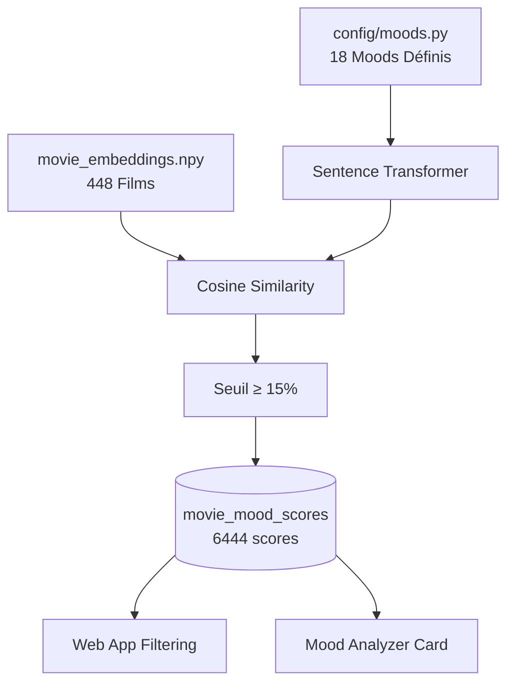

# Pipeline 05 : Build Mood Scores

> **Objectif** : Calculer des scores de similarité sémantique entre des "moods" prédéfinis et les films, permettant un filtrage intuitif des recommandations par ambiance.

---

## 🎯 Intention

Les utilisateurs ne pensent pas toujours en termes de genres. Ils cherchent souvent une *ambiance* :
- "Je veux quelque chose de léger ce soir"
- "J'ai besoin d'adrénaline"
- "Envie de voyager sans bouger"

Ce pipeline transforme ces besoins émotionnels en filtres exploitables via des embeddings sémantiques.

---

## 🔄 Flux de Données



---

## 📋 Configuration des Moods

**Fichier** : `apps/ml/config/moods.py`

Chaque mood est défini par :
- **id** : Identifiant technique (ex: `adrenaline`)
- **name** : Nom affiché à l'utilisateur (ex: `Besoin d'adrénaline`)
- **description** : Texte riche pour l'embedding (ex: `Action intense, explosions, courses poursuites...`)

### Liste des 18 Moods

| ID | Nom FR | Description (orientée embedding) |
|----|--------|----------------------------------|
| `adrenaline` | Besoin d'adrénaline | Action, explosions, courses poursuites |
| `adventure` | Évasion & Aventure | Exploration, voyage, découverte |
| `animation` | Un peu de magie | Animation, conte, merveilleux |
| `comedy` | Besoin de rire | Humour, comédie, légèreté |
| `crime` | Thriller & Polar | Enquête policière, crime, suspense |
| `documentary` | Apprendre quelque chose | Documentaire, réalité, culture |
| `drama` | Émotion & Drame | Drame profond, émotions, introspection |
| `family` | En famille | Tout public, chaleureux |
| `fantasy` | Mondes imaginaires | Fantasy, univers créé, magie |
| `history` | Histoire & Passé | Époque historique, biopic |
| `horror` | Frisson & Horreur | Terreur, angoisse, surnaturel |
| `music` | Musique & Rythme | Musical, concert, mélodies |
| `mystery` | Mystère & Enquête | Énigme, intrigue, secrets |
| `romance` | Amour & Romance | Relation amoureuse, passion |
| `scifi` | Futur & SF | Science-fiction, technologie, espace |
| `thriller` | Suspense total | Tension, course contre la montre |
| `war` | Guerre & Conflit | Conflits armés, soldats, survie |
| `western` | Cowboys & Western | Far West, duels, frontière |

---

## 🧠 Algorithme

### 1. Encodage des Moods

```python
from sentence_transformers import SentenceTransformer

model = SentenceTransformer("paraphrase-multilingual-MiniLM-L12-v2")
mood_embeddings = model.encode([mood["description"] for mood in MOODS])
```

### 2. Chargement des Embeddings Films

```python
import numpy as np

movie_embeddings = np.load("data/embeddings/movie_embeddings.npy")
# Shape: (448, 384) - 448 films, 384 dimensions
```

### 3. Calcul de Similarité Cosinus

```python
from sklearn.metrics.pairwise import cosine_similarity

# Pour chaque mood (18) × chaque film (448) = 8064 scores potentiels
scores = cosine_similarity(mood_embeddings, movie_embeddings)
```

### 4. Filtrage et Stockage

Seuls les scores ≥ 15% sont stockés pour éviter le bruit :

```python
for mood_idx, mood in enumerate(MOODS):
    for movie_idx, score in enumerate(scores[mood_idx]):
        if score >= 0.15:
            save_to_db(tmdb_id=..., mood_id=mood["id"], similarity_score=score)
```

---

## 💾 Schéma Base de Données

### Table `moods`

```sql
CREATE TABLE moods (
    id TEXT PRIMARY KEY,          -- ex: 'adrenaline'
    name TEXT NOT NULL,           -- ex: 'Besoin d'adrénaline'
    description TEXT NOT NULL,    -- Texte riche pour embedding
    embedding VECTOR(384)         -- Embedding du mood (optionnel, pour debug)
);
```

### Table `movie_mood_scores`

```sql
CREATE TABLE movie_mood_scores (
    tmdb_id INT REFERENCES movies(tmdb_id),
    mood_id TEXT REFERENCES moods(id),
    similarity_score REAL NOT NULL,  -- Score 0.0 à 1.0
    PRIMARY KEY (tmdb_id, mood_id)
);
```

### Fonctions RPC

```sql
-- Récupérer candidats filtrés par mood
CREATE FUNCTION get_candidates_by_mood(
    p_mood_id TEXT,
    p_min_score REAL DEFAULT 0.15,
    p_limit INT DEFAULT 50,
    p_offset INT DEFAULT 0
) RETURNS TABLE (...)

-- Compter candidats par mood
CREATE FUNCTION count_candidates_by_mood(
    p_mood_id TEXT,
    p_min_score REAL DEFAULT 0.15
) RETURNS INT
```

---

## 🚀 Exécution

### Prérequis

- Pipeline 03 exécuté (`movie_embeddings.npy` existe)
- Connexion Supabase active

### Commande

```bash
cd apps/ml
python pipelines/05_build_mood_scores.py
```

### Output Attendu

```
=== Pipeline 05: Build Mood Scores ===
Loading embedding model...
Loading movie embeddings: 448 films
Encoding 18 moods...
Computing cosine similarities...
Upserting moods to database...
Inserting 6444 mood scores...
✓ Complete: 6444 scores for 18 moods
⏱ Duration: 45s
```

---

## 🔧 Tuning

| Paramètre | Valeur Actuelle | Impact |
|-----------|-----------------|--------|
| Seuil minimum | 15% | Plus bas = plus de résultats mais moins précis |
| Moods | 18 | Ajouter/modifier dans `config/moods.py` |
| Descriptions | Rich text EN | Descriptions plus longues = embeddings plus précis |

### Ajouter un Nouveau Mood

1. Éditer `config/moods.py` :
```python
{
    "id": "noir",
    "name": "Film Noir",
    "description": "Dark crime drama, femme fatale, shadows, cynical detective..."
}
```

2. Relancer le pipeline :
```bash
python pipelines/05_build_mood_scores.py
```

---

## 🔗 Intégration Web

### Filtrage (Page Recommandations)

Le service `movie-service.ts` utilise les fonctions RPC :

```typescript
const { data } = await supabase.rpc('get_candidates_by_mood', {
    p_mood_id: 'animation',
    p_min_score: 0.15,
    p_limit: 50
});
```

### Affichage (Page Film)

Le composant `MoodAnalyzerCard` affiche :
- Mood principal (le plus élevé)
- 3 moods secondaires en tags

---

## 📊 Métriques Actuelles

| Métrique | Valeur |
|----------|--------|
| Films avec embeddings | 448 |
| Moods définis | 18 |
| Scores stockés | 6,444 |
| Seuil d'affichage | 15% |
| Score moyen | ~35% |
| Score max observé | ~70% |

---

## 🐛 Dépannage

| Problème | Cause | Solution |
|----------|-------|----------|
| `movie_embeddings.npy not found` | Pipeline 03 non exécuté | Lancer pipeline 03 d'abord |
| Aucun score pour un film | Score < seuil ou pas d'embedding | Vérifier `movie_features` |
| Mood non affiché | ID non reconnu | Vérifier `config/moods.py` |

---

## 📚 Références

- [Pipeline 03 : Build Embeddings](03-build-embeddings.md)
- [Sentence Transformers](https://www.sbert.net/)
- [Cosine Similarity](https://en.wikipedia.org/wiki/Cosine_similarity)
