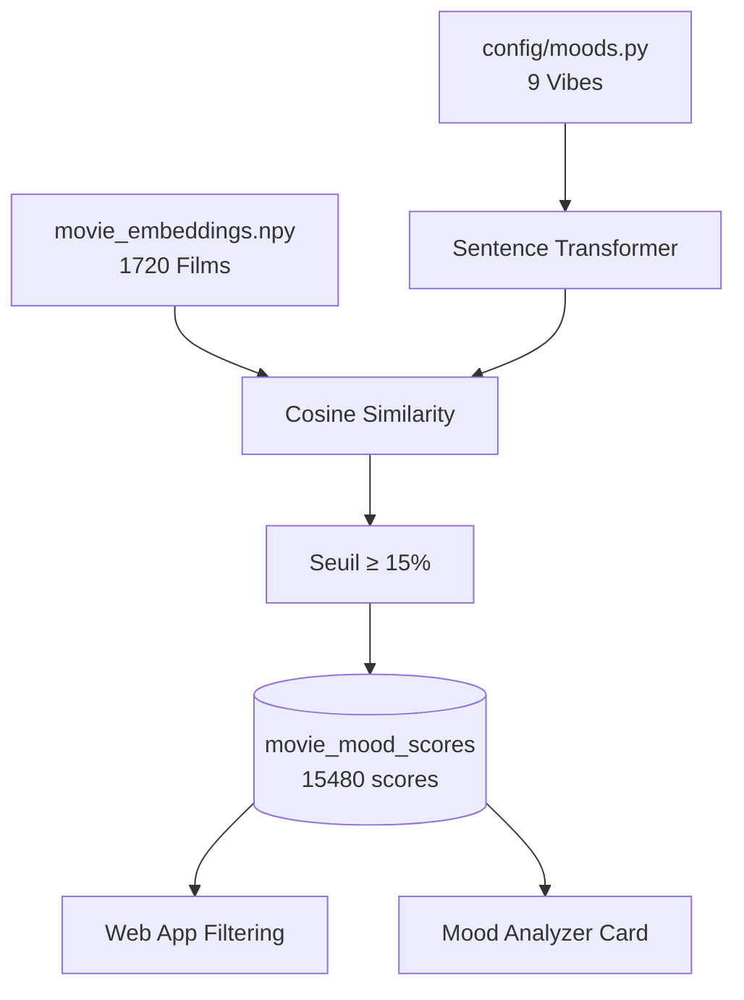

# Pipeline 05 : Build Mood Scores (Système de Vibes)

> **Objectif** : Calculer des scores de similarité sémantique entre des "vibes" prédéfinies et **tous les films avec embedding**, permettant un filtrage intuitif des recommandations par atmosphère.

---

## 🎯 Intention

Les utilisateurs ne pensent pas toujours en termes de genres. Ils cherchent souvent une *atmosphère* :
- "Je veux quelque chose qui retourne le cerveau"
- "J'ai besoin d'un truc feel-good"
- "Envie d'un film sombre et réaliste"

Ce pipeline transforme ces besoins émotionnels en filtres exploitables via des embeddings sémantiques.

### Différence Genres vs Vibes

| Genres (ancien système) | Vibes (nouveau système) |
|-------------------------|-------------------------|
| Action, Comédie, Drame... | Mind-bending, Feel Good, Tension... |
| 1 film = N genres fixes | 1 film = scores sur toutes les vibes |
| Catégorisation TMDb | Analyse sémantique Apollo |
| Pas de cross-genre | Un thriller peut être "Feel Good" |

---

## 🔄 Flux de Données



---

## 📋 Configuration des Vibes

**Fichier** : `apps/ml/config/moods.py`

Chaque vibe est définie par :
- **id** : Identifiant technique (ex: `mind_bending`)
- **name** : Nom affiché à l'utilisateur (ex: `Retourne le cerveau`)
- **description** : Texte riche pour l'embedding (ex: `Mind-bending, philosophie, paradoxe temporel...`)

### Les 9 Vibes

| ID | Nom FR | Description (exemples de films) |
|----|--------|--------------------------------|
| `mind_bending` | Retourne le cerveau | Puzzles mentaux, twists (*Inception, Matrix, Tenet*) |
| `feel_good` | Ça fait du bien | Réconfortant, optimiste (*Intouchables, Amélie, Paddington*) |
| `dark_gritty` | Sombre & Réaliste | Viscéral, brut, pessimiste (*Joker, Se7en, Requiem for a Dream*) |
| `tension` | Tension pure | Adrénaline, stress, urgence (*Mad Max, Whiplash, Sicario*) |
| `surreal` | Onirique & Étrange | Surréaliste, poétique (*Spirited Away, Mulholland Drive*) |
| `epic` | Grand Spectacle | Épique, grandiose (*Dune, Gladiator, LOTR*) |
| `intimate` | Intimiste & Calme | Contemplatif, lent (*Lost in Translation, Paterson*) |
| `nostalgia` | Nostalgie | Rétro, mélancolie douce (*Stranger Things, Stand By Me*) |
| `disturbing` | Dérangeant & Viscéral | Malaise, provocant (*Midsommar, Hereditary*) |

---

## 🧠 Algorithme

### 1. Encodage des Vibes

```python
from sentence_transformers import SentenceTransformer

model = SentenceTransformer("paraphrase-multilingual-MiniLM-L12-v2")
vibe_embeddings = model.encode([vibe["description"] for vibe in MOODS])
# Shape: (9, 384) - 9 vibes, 384 dimensions
```

### 2. Chargement des Embeddings Films

```python
import numpy as np

movie_embeddings = np.load("data/embeddings/movie_embeddings.npy")
# Shape: (1720, 384) - 1720 films, 384 dimensions
```

### 3. Calcul de Similarité Cosinus

```python
from sklearn.metrics.pairwise import cosine_similarity

# Pour chaque vibe (9) × chaque film (1720) = 15480 scores
for tmdb_id in all_movie_ids:
    movie_emb = movie_embeddings[tmdb_to_index[tmdb_id]]
    similarities = cosine_similarity([movie_emb], vibe_embeddings)[0]
```

### 4. Filtrage et Stockage

Seuls les scores ≥ 15% sont stockés pour éviter le bruit :

```python
for vibe_idx, vibe in enumerate(MOODS):
    if similarities[vibe_idx] >= 0.15:
        save_to_db(tmdb_id=tmdb_id, mood_id=vibe["id"], similarity_score=score)
```

---

## 💾 Schéma Base de Données

### Table `moods`

```sql
CREATE TABLE moods (
    id TEXT PRIMARY KEY,          -- ex: 'mind_bending'
    name TEXT NOT NULL,           -- ex: 'Retourne le cerveau'
    description TEXT NOT NULL,    -- Texte riche pour embedding
    embedding VECTOR(384)         -- Embedding de la vibe
);
```

### Table `movie_mood_scores`

```sql
CREATE TABLE movie_mood_scores (
    tmdb_id INT REFERENCES movies(tmdb_id),
    mood_id TEXT REFERENCES moods(id),
    similarity_score REAL NOT NULL,  -- Score 0.0 à 1.0
    PRIMARY KEY (tmdb_id, mood_id)
);
```

### Fonctions RPC

```sql
-- Récupérer candidats filtrés par vibe (triés par score décroissant)
CREATE FUNCTION get_candidates_by_mood(
    p_mood_id TEXT,
    p_min_score REAL DEFAULT 0.15,
    p_limit INT DEFAULT 50,
    p_offset INT DEFAULT 0
) RETURNS TABLE (...)
ORDER BY mms.similarity_score DESC, tc.taste_score DESC
```

---

## 📊 Affichage Frontend

### Conversion Score → Note /10

Le score brut (0-1) est converti en note `/10` où **10/10 = 60%+ de similarité** :

```typescript
// apps/web/src/utils/mood-format.ts
export function formatMoodScore(score: number): string {
    const scaled = Math.min(10, Math.round((score / 0.6) * 10));
    return `${scaled}/10`;
}
```

| Score brut | Note affichée |
|------------|---------------|
| 60%+ | 10/10 |
| 54% | 9/10 |
| 48% | 8/10 |
| 42% | 7/10 |
| 36% | 6/10 |

---

## 🚀 Exécution

### Prérequis

- Pipeline 03 exécuté (`movie_embeddings.npy` existe)
- Connexion Supabase active

### Commande

```bash
cd apps/ml
.venv/bin/python pipelines/05_build_mood_scores.py
```

### Output Attendu

```
============================================================
Pipeline 05: Build Mood Scores
============================================================

Loading movie embeddings...
✓ Loaded 1720 movie embeddings

Encoding 9 moods...
✓ Encoded 9 moods

Fetching all movies with embeddings...
✓ Found 1720 movies with embeddings

Calculating scores for 1720 movies × 9 moods...
✓ Generated 15480 scores

Saving moods to database...
✓ Saved 9 moods

============================================================
SAMPLE RESULTS (Top films per mood)
============================================================

🎭 Retourne le cerveau:
   61% - Cube 2: Hypercube
   60% - Spider
   59% - The Cell

🎭 Ça fait du bien:
   47% - The Science of Sleep
   ...
```

---

## 🔧 Tuning

| Paramètre | Valeur Actuelle | Impact |
|-----------|-----------------|--------|
| Seuil minimum | 15% | Plus bas = plus de résultats mais moins précis |
| Seuil 10/10 | 60% | Ajuste la sévérité de la notation |
| Vibes | 9 | Ajouter/modifier dans `config/moods.py` |
| Descriptions | Texte FR riche | Descriptions plus longues = embeddings plus précis |

### Ajouter une Nouvelle Vibe

1. Éditer `config/moods.py` :
```python
{
    "id": "noir",
    "name": "Film Noir",
    "description": "Film noir classique, détective cynique, femme fatale, ombres, pluie, intrigue criminelle..."
}
```

2. Relancer le pipeline :
```bash
.venv/bin/python pipelines/05_build_mood_scores.py
```

3. Mettre à jour le frontend :
   - `GenreMoodFilter.tsx` : Ajouter au dropdown
   - `MoodAnalyzerCard.tsx` : Ajouter une couleur dans `MOOD_COLORS`

---

## 📊 Métriques Actuelles

| Métrique | Valeur |
|----------|--------|
| Films avec embeddings | 1720 |
| Vibes définies | 9 |
| Scores stockés | 15,480 |
| Seuil d'affichage | 15% |
| Score max observé | ~62% |
| Seuil pour 10/10 | 60% |

---

## 🐛 Dépannage

| Problème | Cause | Solution |
|----------|-------|----------|
| `movie_embeddings.npy not found` | Pipeline 03 non exécuté | Lancer pipeline 03 d'abord |
| Aucun score pour un film | Score < seuil ou pas d'embedding | Vérifier `movie_features` |
| Vibe non affichée | ID non reconnu dans frontend | Vérifier `GenreMoodFilter.tsx` |
| Tous les scores à 10/10 | Seuil trop bas | Augmenter le diviseur dans `formatMoodScore` |

---

## 📚 Références

- [Pipeline 03 : Build Embeddings](03-build-embeddings.md)
- [Sentence Transformers](https://www.sbert.net/)
- [Cosine Similarity](https://en.wikipedia.org/wiki/Cosine_similarity)
